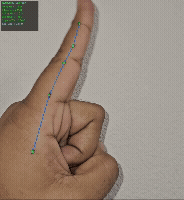

# DLC-Live-Pytorch: A High-Performance, Real-Time DeepLabCut Inference GUI

[](https://www.python.org/downloads/)
[](https://pytorch.org/)
[](https://github.com/DeepLabCut/DeepLabCut)
[](https://opensource.org/licenses/MIT)

> A standalone, multi-process application for running DeepLabCut-PyTorch models in real-time with a responsive PyQt5 GUI.



---

## Table of Contents
- [✨ Core Features](#-core-features)
- [🏗️ System Architecture](#-system-architecture)
- [🛠️ Installation](#-installation)
- [5. How to Use](#5-how-to-use)
- [🧭 GUI Panel Guide](#-gui-panel-guide)
- [7. Performance & System Requirements](#7-performance--system-requirements)
- [8. License](#8-license)
- [9. Acknowledgements](#9-acknowledgements)

---

## ✨ Core Features

This application was built to assist researchers in using the Advanced DeepLabCut inference architecture in real time. It could be used for demonstration or Closed Loop systems that require low latency sampling.

* **Multi-Process Architecture:** The GUI, video capture, and model inference run on **separate processes**. This ensures that complex model inference (even on a GPU) **will never freeze the user interface**, guaranteeing a smooth, responsive experience.

* **🧠 Automatic Memory Leak Mitigation:** This is the project's most critical feature for long-term experiments.
  - It actively **monitors the RAM usage** of the inference process.  
  - If RAM exceeds a user-defined threshold, it **automatically starts a new, clean *standby* process** in the background.  
  - Once the new process is ready, it **"hot-swaps" the video stream** to it with zero downtime.  
  - The old, high-RAM process is safely terminated, allowing the application to **run indefinitely without crashing.**

* **📈 Low-Latency "Stale Frame" Skipping:** The GUI features a dedicated update thread that intelligently **drains the results queue**. It always renders the *most recent* available frame, skipping stale ones, keeping system latency low for closed-loop applications.

* **🖥️ Full-Featured & Responsive GUI:**
  - **Dual Modes:** A lightweight **"Preview Mode"** for setting up the camera and cropping, and a high-performance **"Analysis Mode"** for running the model.  
  - **Real-time Camera Controls:** Instantly adjust Exposure, Gain, and White Balance on-the-fly (for compatible USB cameras).  
  - **Dynamic Visual Cropping:** Define a crop region *before* inference to save processing power.  
  - **Image Pre-processing:** Apply "Flat-Field Correction" or "Morphological Opening".

* **🎥 Robust Data & Video Logging:**
  - **Automatic Video Recording:** Save processed video (with skeleton overlays) as `.mp4`.  
  - **Detailed CSV Logging:** Frame-by-frame `.csv` with timestamps, inference times, and coordinates for every body part. Useful for closed-loop systems requiring CSV coordinate outputs.

---

## 🏗️ System Architecture

The application's high performance and stability are achieved through a decoupled, multi-process architecture. This isolates resource-intensive tasks (like model inference) from the main GUI thread, preventing freezes and crashes.

The system's most critical feature is its **automatic memory-leak mitigation**, visualized below.

```mermaid
graph TD
    subgraph Main GUI Process
        A[VideoProcessingThread] -->|Overwrites frame| B("FrameHandoff_A [maxsize=1]")
        A -.->|Hot-Swapped| B2("FrameHandoff_B [maxsize=1]")
        
        D[InferenceProcessManager]
        
        C(ResultsQueue) --> F[GuiUpdateWorker]
        F -->|Most Recent Frame| G(Main GUI Thread)
    end
    
    subgraph Dedicated Inference Process A (Active)
        B --> E[Inference_A (Model)]
        E -->|Results| C
    end
    
    subgraph Dedicated Inference Process B (Standby)
        B2 --> E2[Inference_B (Model)]
        E2 -->|Results| C
    end

    %% Hot-Swap Logic
    D -.->|1. Monitors RAM| E
    D -- 2. Detects High RAM --> D
    D -- 3. Starts --> E2
    D -- 4. Swaps Video Feed --> A
    D -- 5. Stops --> E
```

---

## 🛠️ Installation

This project relies on the DeepLabCut environment. The recommended way to install is by using `conda` to create a clean, dedicated environment.

### Step 1: Create the Conda Environment

Recommended Python version: **3.12** or **3.11**

```bash
conda create -n DEEPLABCUT python=3.12
```

### Step 2: Activate the Environment

```bash
conda activate DEEPLABCUT
```

### Step 3: Install Core Dependencies (PyTables & PyTorch)

First, install **PyTables**:

```bash
conda install -c conda-forge pytables==3.8.0
```

Next, install **PyTorch** with GPU support (highly recommended). You must install the version compatible with your CUDA version. Find the correct command at: [https://pytorch.org/get-started/locally/](https://pytorch.org/get-started/locally/)

Example for **CUDA 11.3**:

```bash
conda install pytorch cudatoolkit=11.3 -c pytorch
```

### Step 4: Install DeepLabCut with GUI Support

Install the latest pre-release of DeepLabCut with `[gui]` support (which includes PyQt5):

```bash
pip install --pre deeplabcut[gui]
```

### Step 5: (Optional) Verify GPU Installation

To check if PyTorch can see your GPU, run:

```bash
python -c "import torch; print(torch.cuda.is_available())"
```
If it prints **True**, your GPU installation is working. If it prints **False**, reinstall PyTorch with the correct CUDA support.

### Step 6: Clone This Repository

Clone the DLC-Live-Pytorch repository:

```bash
git clone [https://github.com/GSumanth109/DLC-Live-Pytorch-.git](https://github.com/GSumanth109/DLC-Live-Pytorch-.git)
cd DLC-Live-Pytorch-
```

### Step 7: Install Project-Specific Requirements

Install the final dependencies (like `psutil` for memory monitoring). Make sure you are in the `DLC-Live-Pytorch-` directory.

```bash
pip install -r requirements.txt
```

You are now ready to run the application!

---

## 5. How to Use

After completing the installation, you are ready to run the application.

### ⚠️ Step 1: CRITICAL - Configure Your Model's Skeleton

Before you run, you **must** update the `utils/drawing.py` file to match the skeleton of your specific DeepLabCut model. If you skip this, the skeleton overlay will not be drawn correctly.

1.  Open the file `utils/drawing.py` in a text editor.
2.  Find the `draw_skeleton` function (around line 30).
3.  Locate the `skeleton = [...]` list inside that function.
4.  Modify this list to match the `skeleton:` entry from your model's `config.yaml` file. You will need to map the part names (e.g., `'nose'`, `'left_eye'`) to their corresponding 0-based indices.

**Example:**
If your `config.yaml` has `bodyparts: [nose, left_eye, right_eye]` and `skeleton: [[nose, left_eye], [nose, right_eye]]`, your `skeleton` list in `drawing.py` must be:

```python
skeleton = [
    (0, 1),  # nose -> left_eye
    (0, 2)   # nose -> right_eye
]
```

### Step 2: Run the Application

With your `DEEPLABCUT` conda environment activated, run the `main.py` script:

```bash
python main.py
```

### Step 3: Application Workflow

The application will launch in **"Preview Mode"**, a lightweight mode for setting up your session.

1.  **Load Files:** In **Group 1: Input Model**, browse for your DLC `config.yaml` file and your trained PyTorch `snapshot.pt` file.
2.  **Configure Source:** In **Group 2: Source**, select "USB Webcam" or "Video File".
3.  **Adjust Preview (Preview Mode):** The "Original" video feed will be live. Use this feed to:
    * Adjust camera focus.
    * Set camera properties (Exposure, Gain, etc.) in **Group 4: Realtime**.
    * Enable and adjust the cropping rectangle in **Group 5: Cropping**.
4.  **Configure Outputs:** In **Group 8: Output**, check "Save CSV" and/or "Save Drawn Video" and set their output paths.
5.  **Start Analysis:** When ready, click the **"Start Analysis"** button.
    * The "Preview Mode" will stop.
    * The dedicated inference process will start (this may take a few seconds).
    * The "Processed" feed will come alive with your model's predictions.
    * Recording will begin automatically if enabled.
6.  **Stop Analysis:** Click **"Stop Analysis"** to safely shut down all processes, finalize video/CSV files, and return to "Preview Mode".

---

## 🧭 GUI Panel Guide

All settings are configured from the panels on the left side of the application.

| Group # | Name | Description |
| :--- | :--- | :--- |
| **1** | **Input Model** | Load the main DLC `config.yaml` and the `snapshot.pt` model file. |
| **2** | **Source** | Select the input: "USB Webcam" (by index) or "Video File" (by path). |
| **3** | **Cam Params** | Set camera properties (Width, Height, FPS). Click "Reload Source" to apply. |
| **4** | **Realtime** | Sliders to adjust Exposure, Gain, and White Balance on-the-fly (USB cams only). |
| **5** | **Cropping** | Enable and define a crop-box. This crops the image *before* sending it to the model. |
| **6** | **Pre-processing** | Apply image processing *before* cropping (e.g., "Flat-field" correction). |
| **7** | **Performance** | Tweak runtime settings: `RAM Rst` (RAM limit for hot-swap), `FP16` (for faster GPU inference), `Disp FPS` (GUI update rate). |
| **8** | **Output** | Enable and set paths for saving the `CSV` data file and the drawn `MP4` video file. |
| **9** | **Capture** | Take a "Photo" to save the current Original and Processed frames as JPGs. |
| **10** | **Stats** | Real-time performance counters (Frames Captured, Processed, Dropped, etc.). |

---

## 7. Performance & System Requirements

### Performance

This system is a PyTorch implementation of a real-time DeepLabCut pipeline, designed to track objects or animals using a `.pt` model file and its corresponding `config.yaml`.

The architecture is optimized for low-latency, high-FPS inference. In testing, the system can achieve:
* **~60 FPS**
* **~16ms Inference Latency**

*(These metrics were achieved on a 640x480 resolution stream using a ResNet-50 model and an NVIDIA RTX 4090.)*

### System Requirements

* **Recommended GPU:** For the best performance (60 FPS+), a high-end NVIDIA GPU (e.g., **RTX 4090**) is recommended. The application will run on lower-spec GPUs, but performance may vary.
* **Operating System:** This application has been developed and tested primarily on **Windows**. Due to differences in how `multiprocessing` ("spawn" vs. "fork") is handled, it is **not guaranteed to work correctly on Ubuntu/Linux** at this time.

---

## 8. License

This project is licensed under the MIT License. See the `LICENSE` file for more details.

---

## 9. Acknowledgements

This project is a standalone GUI and pipeline manager that utilizes the inference engine from the official [DeepLabCut](https://github.com/DeepLabCut/DeepLabCut) repository. Many thanks to the entire DeepLabCut team for their incredible work.
